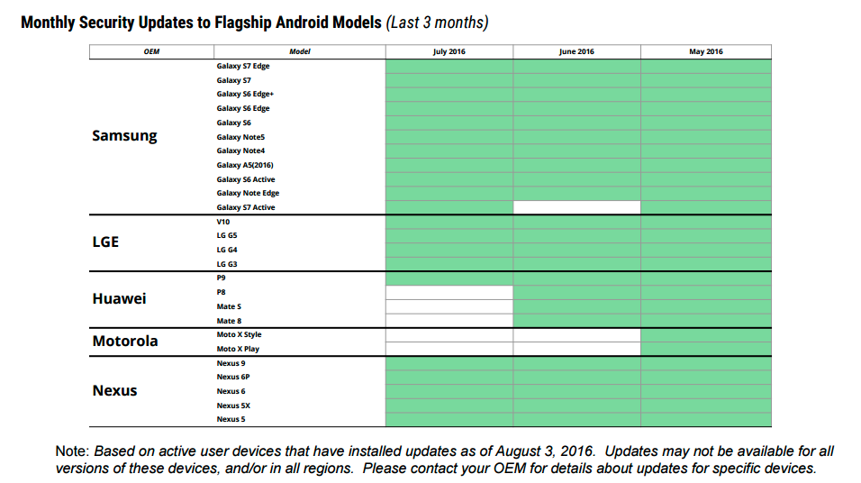

# Monthly Official Security Patches

- [android.os.build.VERSION.SECURITY_PATCH](https://developer.android.com/reference/android/os/Build.VERSION.html#SECURITY_PATCH)
  - Available since M-6-23
  - IO16 talk [says available from K+](https://youtu.be/XZzLjllizYs?t=2344) but not sure how if only in since M
  - If no security patch installed have observed an empty `String` here (Nexus 5 running 6). Anecdontally people have seen the last OS OTA update date here also

# OEM support

No single place for this data atm. 

[Blog post](https://arstechnica.com/gadgets/2017/05/op-ed-google-should-take-full-control-of-androids-security-updates/) from May 2017

> The problem is that phone makers are still in full control of these updates, and their commitment to actually releasing them is all over the place. Google updates Nexus and Pixel phones and tablets directly, and as long as they’re within their three-year-ish support window you can expect security updates even after Google stops giving you major version updates (for example, the Nexus 9 isn’t getting Android 7.1.2, but you can still download the May 2017 security update for Android 7.1.1). At best, OEMs like Samsung and LG generally release them monthly, but only for “major flagship models;" at worst, companies like Motorola promise “quarterly” updates that they don’t always actually stick to, and good luck getting any kind of commitment at all from no-name phone makers like Blu.

[The Art of Defense](https://www.blackhat.com/docs/us-16/materials/us-16-Kralevich-The-Art-Of-Defense-How-Vulnerabilities-Help-Shape-Security-Features-And-Mitigations-In-Android.pdf) shows:

# Links

- [Nexus device support life-cycle stats](https://twitter.com/myhndl/status/778306086319321088)
